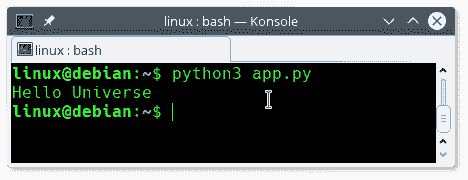

# 字符串替换

> 原文： [https://pythonbasics.org/replace/](https://pythonbasics.org/replace/)

Python 内置了对[字符串](https://pythonbasics.org/strings/)替换的支持。 字符串是包含文本数据的变量。 如果您不了解字符串，则可以在[本文](https://pythonbasics.org/strings/)中阅读有关字符串的更多信息。

可以使用 string 对象调用 string.replace（old，new）方法。 本文演示了替换方法。

并非所有的编程语言都具有标准的字符串替换功能。 Python 具有许多现成的功能。

**相关课程：** [完整的 Python 编程课程&练习](https://gum.co/dcsp)

## 示例

### 替换方法

定义一个字符串并调用 replace（）方法。 第一个参数是要搜索的单词，第二个参数指定新值。

输出需要保存在字符串中。 如果您不保存输出，则字符串变量将包含相同的内容。 使用以下命令完成输出保存：s = function（）

请尝试以下程序：

```py
s = "Hello World"
s = s.replace("World","Universe")
print(s)

```

将程序另存为 app.py，然后在终端（或 IDE）中运行

```py
python app.py

```

这将输出字符串变量 s 的新输出：



### 要替换的单词数

可选参数是将要替换的项目数。 默认情况下是全部。
下面的程序仅替换第一项：

```py
s = "Hello World World World"
s = s.replace("World","Universe",1)
print(s)

```

参数（1）表示该字符串仅应替换一次。

## 练习

下面的练习

1.  尝试更换程序
2.  字符串可以替换两次吗？
3.  是否仅用单词或短语替换？

[下载示例](https://gum.co/dcsp)