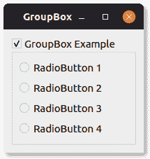

# PyQt 分组框

> 原文： [https://pythonbasics.org/pyqt-groupbox/](https://pythonbasics.org/pyqt-groupbox/)

分组框`QGroupBox`可以对小部件进行分组。 它通常具有标题和边框。 任何小部件都可以添加到分组框中。 这可以进一步用于将 UI / UX 与用户进行通信。

本示例演示如何创建分组框，如下所示：




## `QGroupBox`

### PyQt 分组框

用`QGroupBox("title")`初始化分组框。 然后将布局添加到分组框。 小部件将添加到布局中。

```py
from PyQt5.QtWidgets import *
import sys

class GroupBox(QWidget):

    def __init__(self):
        QWidget.__init__(self)

        self.setWindowTitle("GroupBox")
        layout = QGridLayout()
        self.setLayout(layout)

        groupbox = QGroupBox("GroupBox Example")
        groupbox.setCheckable(True)
        layout.addWidget(groupbox)

        vbox = QVBoxLayout()
        groupbox.setLayout(vbox)

        radiobutton = QRadioButton("RadioButton 1")
        vbox.addWidget(radiobutton)

        radiobutton = QRadioButton("RadioButton 2")
        vbox.addWidget(radiobutton)

        radiobutton = QRadioButton("RadioButton 3")
        vbox.addWidget(radiobutton)

        radiobutton = QRadioButton("RadioButton 4")
        vbox.addWidget(radiobutton)

app = QApplication(sys.argv)
screen = GroupBox()
screen.show()
sys.exit(app.exec_())

```

[下载示例](https://gum.co/pysqtsamples)