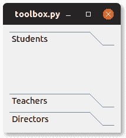

# pyqt 工具箱

> 原文： [https://pythonbasics.org/pyqt-toolbox/](https://pythonbasics.org/pyqt-toolbox/)

工具箱是一个容器。 它可以显示由选项卡分隔的项目组。 如果工具栏有很多项目，则可能需要一个工具箱。

工具箱`QToolBox`的屏幕截图如下所示。



**相关课程：**
[带有 Python 的 PyQt 桌面应用程序](https://gum.co/pysqtsamples)

## 工具箱示例

### QToolBox

下面的代码创建一个包含 3 个项目的工具箱。 工具箱`QToolBox`具有方法`.addItem()`。

工具箱本身必须添加到布局中，例如`layout.addWidget(toolbox, 0, 0)`。

```
from PyQt5.QtWidgets import *
import sys

class Window(QWidget):

    def __init__(self):
        QWidget.__init__(self)
        layout = QGridLayout()
        self.setLayout(layout)

        # Add toolbar and items
        toolbox = QToolBox()
        layout.addWidget(toolbox, 0, 0)
        label = QLabel()
        toolbox.addItem(label, "Students")
        label = QLabel()
        toolbox.addItem(label, "Teachers")
        label = QLabel()
        toolbox.addItem(label, "Directors")

app = QApplication(sys.argv)
screen = Window()
screen.show()
sys.exit(app.exec_())

```

[下载示例](https://gum.co/pysqtsamples)