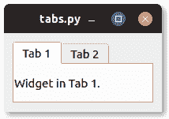

# PyQt TabWidget

> 原文： [https://pythonbasics.org/pyqt-TabWidget/](https://pythonbasics.org/pyqt-TabWidget/)

标签可以添加到`QTabWidget`中。 `QTabWidget`可以添加到布局中，也可以添加到窗口中。

可以有任意数量的标签。 下例显示了添加标签的窗口。



_ 图片：在 pyqt 窗口中显示的标签。_


[带有 Python 的 PyQt 桌面应用程序](https://gum.co/pysqtsamples)

## 标签示例

### PyQt 标签示例

运行以下代码，以在 pyqt 窗口中查看选项卡小部件。 在选项卡之间导航会显示添加到选项卡的小部件。

要将选项卡添加到`QTabWidget`，请调用方法`.addTab()`。

```py
from PyQt5.QtCore import *
from PyQt5.QtWidgets import *
import sys

class Window(QWidget):
    def __init__(self):
        QWidget.__init__(self)
        layout = QGridLayout()
        self.setLayout(layout)
        label1 = QLabel("Widget in Tab 1.")
        label2 = QLabel("Widget in Tab 2.")
        tabwidget = QTabWidget()
        tabwidget.addTab(label1, "Tab 1")
        tabwidget.addTab(label2, "Tab 2")
        layout.addWidget(tabwidget, 0, 0)

app = QApplication(sys.argv)
screen = Window()
screen.show()
sys.exit(app.exec_())

```