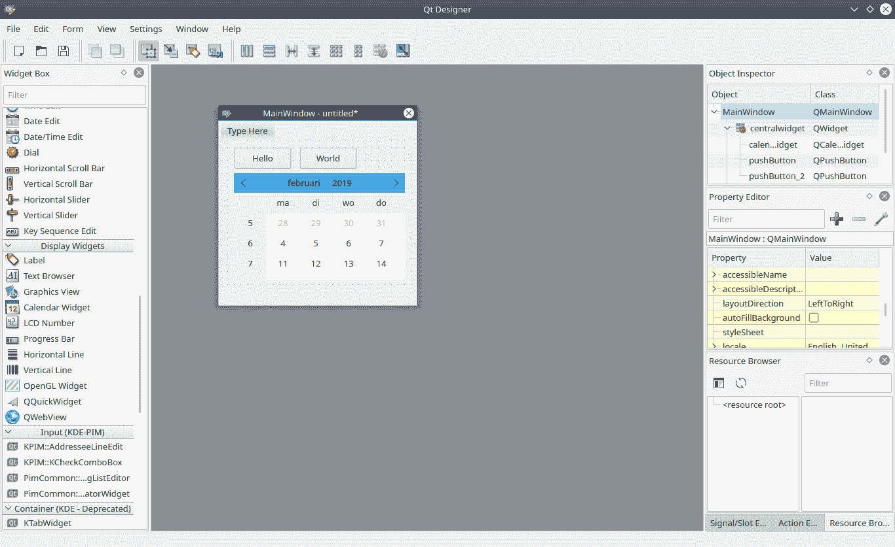

# Qt Designer Python

> 原文： [https://pythonbasics.org/qt-designer-python/](https://pythonbasics.org/qt-designer-python/)

Qt Designer 可以帮助您构建 GUI（图形用户界面）。 您可以从 Python 加载 GUI。 在本教程中，我们将逐步向您展示。

它涵盖了一个非常基本的示例，说明如何将 Qt Designer 与 PyQt 和 Python 一起使用。 有关更多详细信息，请参见下面的链接。


[带有 Python 的 PyQt 桌面应用程序](https://gum.co/pysqtsamples)

## Qt Designer Python

### 先决条件

要开始本教程，您需要安装以下内容：

*   蟒蛇
*   PyQt
*   Qt 设计师

您将需要 Python 3 或更高版本，因为其他版本已过时。

_ 如果您没有 PyQt，请 _ [安装 PyQt](/install-pyqt/) 。

您可以使用以下工具安装 Designer（Ubuntu Linux）：

```py
sudo apt-get install qttools5-dev-tools
sudo apt-get install qttools5-dev

```

在其他平台上，它包含在设置中。

### 如何启动 Designer

通过在命令行中输入`designer`来启动设计器。 重要说明：qt creator 是另一个程序。

在 Ubuntu Linux 上：

```py
cd /usr/lib/x86_64-linux-gnu/qt5/bin/ 
./designer

```

### 基础

出现一个弹出窗口。 您可以选择要设计的东西。


选择“主窗口”，然后单击创建。

然后，您可以调整表单的大小并拖放小部件。 设计这样的图形界面非常简单。

如果单击窗口小部件（例如按钮），则可以设置其属性，例如名称。



### 将设计导出到 UI

您可以将设计导出到 UI 文件。 单击文件&gt;另存为&gt; yourname.ui

然后，您可以将 ui 代码转换为 python 文件。
像这样：

```py
pyuic5 /home/linux/helloworld.ui -o helloworld.py

```

然后，Python 文件包含 gui 定义。
创建另一个加载 ui 文件的文件：

```py
from PyQt5 import QtCore, QtGui, QtWidgets
from PyQt5.QtWidgets import QApplication
import sys
import helloworld

class ExampleApp(QtWidgets.QMainWindow, helloworld.Ui_MainWindow):
    def __init__(self, parent=None):
        super(ExampleApp, self).__init__(parent)
        self.setupUi(self)

def main():
    app = QApplication(sys.argv)
    form = ExampleApp()
    form.show()
    app.exec_()

if __name__ == '__main__':
    main()

```

一旦运行它，GUI 就会出现。

[下载示例](https://gum.co/pysqtsamples)