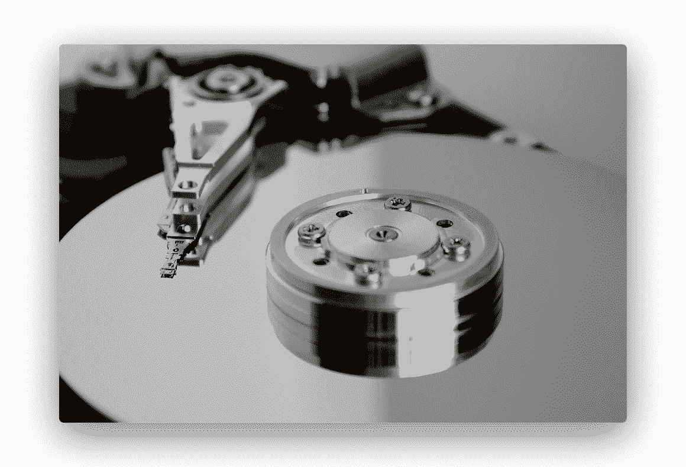

# 数据科学

> 原文： [https://pythonbasics.org/data-science/](https://pythonbasics.org/data-science/)

数据科学是科学地从各种结构化和非结构化数据中提取知识的过程。 它是一个多学科领域，使用不同种类的算法和技术来识别数据的真实目的和含义。

数据科学家需要具备高超的技术才能解释数据并提取含义。 数据科学家需要成为各种数据科学工具的专家，例如分析工具，数据可视化工具，数据库工具和其他工具。 数据科学包括以下组件，数据分析&：

**相关课程：** [Python 机器学习课程](https://gum.co/MnRYU)

## 数据科学

### 探索数据

数据科学主要从探索和分析开始。 数据科学家探索数据并将其处理到微观层次。

在开始数据分析之前，将识别具有不同数据集的常见数据并进行分类。 KNIME，OpenRefin，Orange，RapidMiner，Pentaho，Talend 是用于此类工作的一些数据探索和数据分析工具。

### 数据可视化

数据科学中的可视化意味着通过各种可视内容以更容易理解的方式呈现数据。

这主要是针对不了解数据技术表示形式的普通读者完成的。 数据的可视化对于将数据呈现给最终用户非常有效。

一些数据可视化工具是 Tableau，Infogram，ChartBlocks，Datawrapper，Plotly，RAW，Visual.ly 等。

### 古典机器学习

在数据科学中，计算机本身学习如何使用不同的算法和统计信息来计算不同的数据。

该技术非常耗时且复杂。 但是随着时间的流逝，它现在变得越来越快。

这些类型的计算称为机器学习或人工智能。

它无需程序员的帮助即可自动从工作和系统中学习。 这些类型的软件应用程序根据其计算经验进行学习。

一些机器学习工具包括 Google ML Kit，OpenNN，Apache Mahout，HPE Haven OnDemand，HPE Haven OnDemand 等。

### 深度学习

深度学习或深度学习实际上是机器学习的一部分。 它基于数据表示和算法。

这种深度学习技术对于数据科学至关重要。 ylearn2，Theano，Caffe，Torch，Cuda-convent，Deeplearning4j 这些是用于数据科学中深度学习的一些工具。

### 数据存储和大数据框架

数据是数据科学过程的核心和主要组成部分。 公司将数据存储在大型基础架构中，并为存储的数据设置不同的框架。

所有数据都以井井有条的方式存储，因此用户可以轻松访问和处理数据。 它使数据科学家可以轻松地分析，探索，访问和处理海量数据。

### 的结果

如今，对数据科学的最初威胁是难以阅读某些自然语言，数据处理和图像处理。

尽管开发了各种应用程序和软件来限制这些威胁，但仍出现了新问题。

数据科学是计算机科学中的下一件大事。 对新数据科学家的需求正在迅速扩展，并且该行业正在迅速发展。