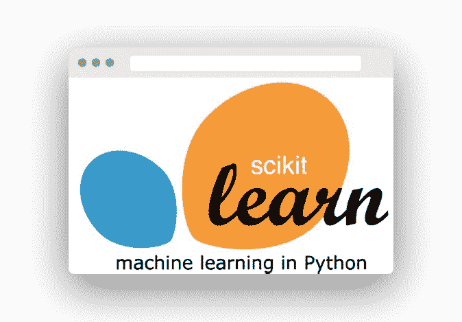

# 机器学习

> 原文： [https://pythonbasics.org/machine-learning/](https://pythonbasics.org/machine-learning/)

在想学习 Python 的人当中，Scikit 是目前最热门的名称之一。 它是最有效的机器学习库。 scikit 最好的部分是初学者可以发现它有效。


## 使用 Python 进行机器学习

### Scikit-Learn 简介

首先，该工具以前称为 _scikit-learn_ ，主要是一个免费的工具机器学习平台，专门用于 Python 编码语言。 该软件带有一系列分类，回归以及一堆算法，其中还包括支持向量机。

也有梯度增强，随机森林，DBSCAN，k-means。 其开发的主要目的是沿着编程编号以及 NumPy 和 Scipy 之类的技术库交换和使用数据。 如上所述，由 David Cournapeau 编写的 Google Summer of Code 项目以 scikit-learn 的形式引入了该机器学习平台。

该名称来源于基本概念，即该产品是“ SciKit”或 SciPy Toolkit，这是 SciPy 的独特制造和提供的外部组件。 然后，其他编码人员再次编写了本机代码平台。 据说 scikit-learn 仍处于开发阶段。



### Scikit 入门

开始执行时，该工具主要是使用 Python 准备的。 但是，某些核心算法是用 Cython 编码的，其主要目的是提高性能。 LIBSVM 上的 Cython 封面执行 _ 支持向量机 _。 另一方面，逻辑回归以及线性支持向量机是通过围绕 LIBLINEAR 的等效覆盖完成的。


最终，机器学习平台简单易用，使数据挖掘和分析变得简单。 每个人都可以使用该工具。 它可以在各个方面重复使用。 这个开源工具也可以用于商业目的。 它所需要的只是拥有 BSD 许可证。 在将本机数据集应用于机器学习后，就可以立即开始一个项目。

```py
pip install sklearn

```

### 应用

初级或初学者的 Python 机器学习过去很难。 但是，用户友好的机器学习平台 Scikit-learn 确实使事情变得更简单。 使用 scikit-learn 学习，以及进行任何类型的定制产品开发或用于 R & D 用途。 Scikit 附带了一系列模块和库，供初学者选择，从而提供了处理特定任务的多种方式。 在学习的同时，可以处理一个完整的项目。

作为工具的 Scikit 非常易于使用。 您可以简单地安装该工具并在初始阶段开始使用 Python Interpreter。 特别是，该工具对于寻找小型端到端项目的初学者可能很有用。

尽管有各种版本的 Scikits 软件，但 Scikit Learn 确实是用于机器学习 Python 的最先进且配备最完善的工具。 Scikit-Image 被认为是同等丰富的工具。