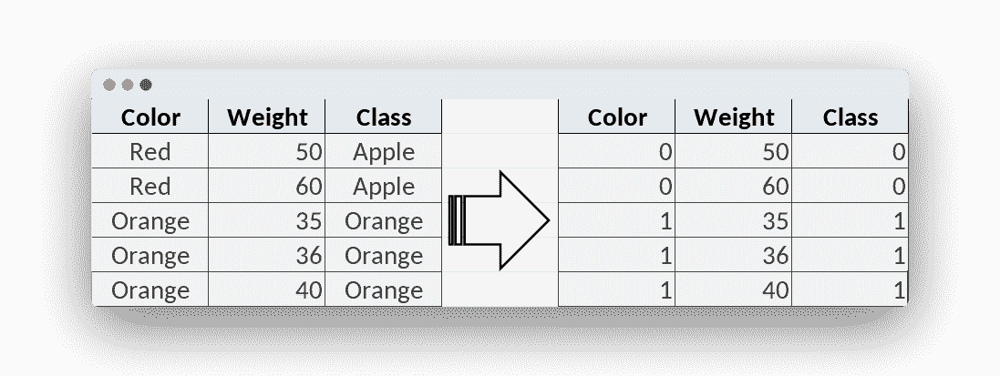

# 机器学习分类器

> 原文： [https://pythonbasics.org/machine-learning-classifier/](https://pythonbasics.org/machine-learning-classifier/)

分类是机器学习任务之一。 那么什么是分类呢？
您一直都在对数据进行分类。

看看任何物体，您将立即知道它属于哪个类：它是杯子，桌子还是椅子。
这是分类的任务，计算机可以执行此操作（基于数据）。

本文是面向初学者的机器学习。 让我们做第一个机器学习程序


## 监督机器学习

### 训练数据

导入机器学习模块 sklearn。 （受监督）机器学习算法使用示例或训练数据。 训练阶段是机器学习算法的第一步。

**由于使用示例数据，因此请首先收集数据。** 像一组苹果和桔子的图像，并记下了特征。

**功能可用于区分两个类别**。 特征是一种属性，例如颜色，形状或重量。 它可以表示为数值。

关键任务之一是从训练数据中获得良好的功能。 写下每个图像的类别。 类别是类，对于苹果，您可以选择 0 类，对于橘子，您可以采用 1 类。

您可以根据需要设置任意多个类，但是在此示例中，我们将使用 2 个类（苹果和橘子）。



水平写入要素，该线代表第一张图像。

因此，这称为特征向量。 这组数字代表图像。

### 分类器

在训练阶段之后，分类器**可以做出预测**。
给定一个新的特征向量，该图像是苹果还是桔子？

分类算法有多种类型，其中一种是决策树。

如果您有新数据，则算法可以确定新数据属于哪个类。
苹果的输出为[0]，橙色的输出为[1]。

所以这是新数据，然后我们简单地使算法进行预测。

```py
from sklearn import tree

features = [[0,50],[0,60],[1,35],[1,36],[1,40]]
labels = [0,0,1,1,1]

algorithm = tree.DecisionTreeClassifier()
algorithm = algorithm.fit(features, labels)

newData = [[0,51]]
print(algorithm.predict(newData))

```

### 过拟合和欠拟合

通常，训练数据越多，分类器就越好。
如果您的训练数据很少（不及），那么您将没有好的预测。

因此，总的来说，随着更多数据它变得更加准确。 但是有一个限制，那就是过拟合。

[下载示例和练习](https://gum.co/MnRYU)