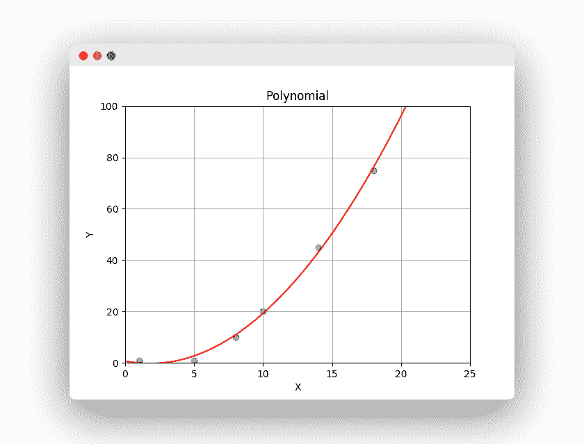

# Python 中的多项式回归

> 原文： [https://pythonbasics.org/polynomial-regression-in-python/](https://pythonbasics.org/polynomial-regression-in-python/)

多项式回归可能非常有用。 X 和 Y 之间并不总是存在线性关系。有时，该关系是指数级或 N 阶。

**相关课程：** [Python 机器学习课程](https://gum.co/MnRYU)

## 回归

### 多项式回归

您可以绘制 X 和 Y 之间的多项式关系。如果没有线性关系，则可能需要多项式。 与线性关系不同，多项式可以更好地拟合数据。



您只需一行代码即可创建此多项式行。

```
poly_fit = np.poly1d(np.polyfit(X,Y, 2))

```

那将训练算法并使用二阶多项式。
训练后，您可以使用一个新示例通过调用 polyfit 来预测值。 然后它将输出一个连续值。

### 范例

下面的示例在收集到的数据上方绘制了一条多项式线。 它训练算法，然后预测连续值。

```
import numpy as np
import matplotlib.pyplot as plt

X = [1, 5, 8, 10, 14, 18]
Y = [1, 1, 10, 20, 45, 75]

# Train Algorithm (Polynomial)
degree = 2
poly_fit = np.poly1d(np.polyfit(X,Y, degree))

# Plot data
xx = np.linspace(0, 26, 100)
plt.plot(xx, poly_fit(xx), c='r',linestyle='-')
plt.title('Polynomial')
plt.xlabel('X')
plt.ylabel('Y')
plt.axis([0, 25, 0, 100])
plt.grid(True)
plt.scatter(X, Y)
plt.show()

# Predict price
print( poly_fit(12) )

```

### 过度拟合和不足

切勿过度拟合或拟合不足，这是很重要的，您想抓住这种关系但又不能完全遵循这些要点。 线性关系会欠拟合，而过度拟合会选择程度高到可以拟合点的程度。 相反，您想要捕获关系。

[下载示例和练习](https://gum.co/MnRYU)