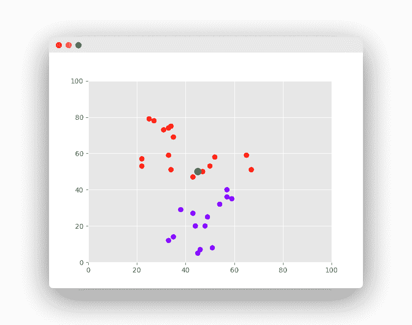

# k 最近邻居

> 原文： [https://pythonbasics.org/k-nearest-neighbors/](https://pythonbasics.org/k-nearest-neighbors/)

认识 K 最近邻居，这是最简单的机器学习算法之一。

该算法用于**分类**和**回归**。 在这两种使用中，输入均包含特征空间中 k 个最接近的训练示例。 另一方面，输出取决于大小写。

*   在“ K 最近邻居分类”中，输出是类成员。
*   在“ K 最近邻回归”中，输出是对象的属性值。

K 最近邻居易于实现，并且能够执行复杂的分类任务。

**相关课程：** [Python 机器学习课程](https://gum.co/MnRYU)

## knn

### k 最近邻居

由于它没有专门的训练阶段，因此被称为**惰性**学习算法。

它是一种非参数学习算法，因此不会对基础数据做任何假设。 由于大多数数据都没有遵循理论上的假设，因此是一项有用的功能。

K-Nearest Neighbors 的最大优势在于，该算法无需进行训练即可进行预测，从而可以添加新数据。

最大的缺点是该算法难以计算高维数据的距离。

### 应用

K 最近邻居有很多应用程序。

一些示例可以是：

*   收集财务特征以将具有相似财务特征的人与数据库进行比较，以进行信用评级。

*   将可能成为潜在选民的人分类为一个政党或另一党，以预测政治。

*   模式识别可检测手写，图像识别和视频识别。

### k 最近邻算法

**K 最近邻居（knn）**具有您应了解的理论。

*   首先，K 最近邻居仅计算新数据点到所有其他训练数据点的距离。 它可以是任何类型的距离。

*   其次，选择 K 个最近的数据点，其中 K 可以是任何整数。

*   第三，它将数据点分配给大多数 K 个数据点所属的类。

理解实际的算法是一个更好的例子。 假设我们要使用的数据集有两个变量。

任务是将带有“ X”的新数据点分类为“红色”类或“蓝色”类。



数据点的坐标值为 x = 45 和 y = 50。

现在我们假设 K 的值为 2（两个簇）。

K 最近邻居算法开始计算点 X 与所有点的距离。

它找到到点 X（黑点）的距离最近的点。

最后一步是为三个最近的点中的大多数都属于的类分配新点。

## 范例

### k 最近邻居 scikit 学习

为了实现 K 最近邻居，我们需要一种编程语言和一个库。

我们建议使用 Python 和 Scikit-Learn。

步骤很简单，程序员必须

> 导入库。
> 导入数据集。
> 进行预处理。
> （可选）拆分训练/测试数据。
> 做出预测。
> （可选）评估算法。

现在，我们可以使用 K 最近邻算法。

```
from sklearn.neighbors import NearestNeighbors
import numpy as np

X = np.array([[-1, -1], [-2, -1], [-3, -2], [1, 1], [2, 1], [3, 2]])
K = 2
nbrs = NearestNeighbors(n_neighbors=K, algorithm='ball_tree').fit(X)
distances, indices = nbrs.kneighbors(X)
print(distances)

```

### k 最近邻分类器

我们用 x 和 y 值创建一个二维空间。 目标包含可能的输出类（通常称为标签）。

knn 可用作分类器。 使用 scikit-learns * KNeighborsClassifier **，其中参数 n_neighbors 为 K。

然后可以对新值进行预测。

```
from sklearn import datasets
from sklearn import metrics
from sklearn.neighbors import KNeighborsClassifier
import numpy as np

# dataset
X = np.array([[-1, -1], [-2, -1], [-3, -2], [1, 1], [2, 1], [3, 2]])
target =  [0, 0, 0, 1, 1, 1]

# fit a k-nearest neighbor model to the data
K = 3
model = KNeighborsClassifier(n_neighbors = K)
model.fit(X, target)
print(model)

# make predictions
print( '(-2,-2) is class'),
print( model.predict([[-2,-2]]) )

print( '(1,3) is class'),
print( model.predict([[1,3]]) )

```

### k 最近邻回归

knn 可用于回归问题。 在下面的示例中，每月租金价格基于平方米（m2）进行预测。

它使用 sklearn 的 **KNeighborsRegressor** 实现。 由于数据集很小，因此将 K 设置为 2 个最近的邻居。

```
from sklearn.neighbors import KNeighborsRegressor

# dataset (X=m^2, y=rental price)
X = [[40], [45], [60], [70]]
y = [1000, 1200, 2000, 2500]

# fit
neigh = KNeighborsRegressor(n_neighbors=2)
neigh.fit(X, y)

# predict
print('Monthly Rental Price for 65m^2 in $'),
print(neigh.predict([[65]]))

```

[下载示例和练习](https://gum.co/MnRYU)