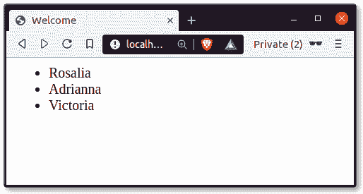

# Flask 教程：模板

> 原文： [https://pythonbasics.org/Flask-Tutorial-Templates/](https://pythonbasics.org/Flask-Tutorial-Templates/)

模板可帮助您重用视觉效果。 在所有 Web 应用程序中，视觉效果都可以重复使用。 这可以帮助您划分业务和表示逻辑。 您不希望您的应用程序代码与图形设计代码混合在一起。

想象一下一个分析应用程序。 您希望每个页面上都有相同的导航和页脚。 内容可能有所不同，但总体设计保持不变。 这是通过模板完成的。

**相关课程：** **[使用 Flask 创建网络应用](https://gum.co/IMzBy)**

## 模板示例

您要做的第一件事是为模板创建目录。 您可以使用以下命令从终端执行此操作。 如果尚未这样做，请[创建一个应用](https://pythonbasics.org/Flask-Tutorial-Hello-World/)。 假设您的项目目录名为“ app”，

```py
(venv) $ mkdir app/templates

```

单个模板只是一个文件。 每个模板都包含 HTML 代码，这是 Web 的标准语言。

### 烧瓶模板变量

让我们创建文件 index.html

```py
<html>
    <head>
        <title>{{ title }}</title>
    </head>
    <body>
        <h1>Hello {{ username }}</h1>
    </body>
</html>

```

其中大多数是 HTML 标记（在&lt;和&gt;符号之间），这是网络上的标准标记。

那么，那些 `{{` 和 `}}` 符号是什么？

这是在网页上显示 Python 变量的方式。 它们是要显示的变量的占位符。

在此模板中，可以传递两个变量：标题和用户名。

## 模板渲染

要知道的关键事情之一是，模板用于将业务逻辑与表示逻辑分开。 这样可以提高软件的可维护性，可扩展性和可移植性。

可以从您的 Python 代码中传递变量。 Python 需要渲染模板，因此需要导入模板。

```py
from flask import render_template

```

更改原始代码：

```py
@app.route('/')
def index():
    return 'Web App with Python Flask!'

```

进入渲染模板并传递变量的代码：

```py
@app.route('/')
@app.route('/index')
def index():
    name = 'Rosalia'
    return render_template('index.html', title='Welcome', username=name)

```

然后启动应用程序：

```py
sudo python3 app.py

```

然后它将在终端中显示一些文本：

```py
* Serving Flask app "app" (lazy loading)
* Environment: production
  WARNING: This is a development server. Do not use it in a production deployment.
  Use a production WSGI server instead.
* Debug mode: off
* Running on http://0.0.0.0:81/ (Press CTRL+C to quit)

```

并在 Web 浏览器中打开终端中显示的 URL。

## render_template

在上面的示例中，您调用了函数`render_template()`。 为什么要调用此方法而不立即返回 html 数据？

Flask 与一种名为 [Jinja2](https://palletsprojects.com/p/jinja/) 的语言捆绑在一起。 这使您能够直接在模板中包含变量，创建循环和添加 if 语句。

在上面的示例中，您已经了解了如何包含`title`和`username`之类的变量。 那么，如何包含循环和 if 语句？


## 烧瓶模板，如果

您可以在模板中包含 if 语句。 可以使用与 Python 中相同的运算符（==，&gt;，&lt;，&gt; =，&lt; =，）。 也可以使用`else`或`elif`之类的子句。

在此代码中，输出将根据输入变量用户名而有所不同。 用户名通过 Python 代码（业务逻辑）传递到模板（表示逻辑）。

```py
<html>
    <head>
        <title>{{ title }}</title>
    </head>
    <body>
        
        <h1>Hello my love</h1>
	
        <h1>Hello {{ username }}</h1>
	
    </body>
</html>

```

## 烧瓶模板用于循环

如果您有大量数据（例如用户列表），则希望使用 for 循环对其进行迭代。 将 Python 代码更改为此：

```py
@app.route('/')
@app.route('/index')
def index():
    users = [ 'Rosalia','Adrianna','Victoria' ]
    return render_template('index.html', title='Welcome', members=users)

```

该代码包括一个列表（用户）。 该列表将传递给 render_template 函数。 在模板中，可以使用 for 循环遍历列表。

```py
<html>
    <head>
        <title>{{ title }}</title>
    </head>
    <body>
        <ul>
        
        <li>{{ member }}</li>
	
	</ul>
    </body>
</html>

```

对于代码，使用标签 `` 。
要显示变量，请写入标签 `{{` 和 `}}` 。



**[下载示例](https://gum.co/IMzBy)**