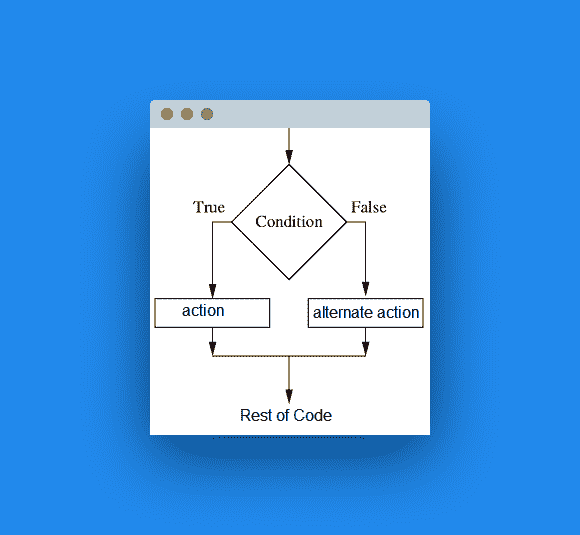

# 如果陈述

> 原文： [https://pythonbasics.org/if-statements/](https://pythonbasics.org/if-statements/)

程序有时可能不得不做出选择。 这些选择可以根据特定条件执行不同的代码。 在 Python 中， **if 语句**用于条件执行。

if 语句可以与某些运算符组合，例如等于（==），大于（&gt; =），小于（&lt; =）且不等于（！=）。 可以使用关键字**或**以及**和**组合条件。

**相关课程：** [完整的 Python 编程课程&练习](https://gum.co/dcsp)

## 范例

在下面的示例中，我们显示了 if 语句的用法。
复制以下程序并运行。

```py
#!/usr/bin/env python3

gender = input("Gender? ")
if gender == "male" or gender == "Male":
    print("Your cat is male")
else:
    print("Your cat is female")

age = int(input("Age of your cat? "))
if age < 5:
    print("Your cat is young.")
else:
    print("Your cat is adult.")

```

if 语句的直观示例（单击放大）：


## 练习

做这些练习：

```py
1\. Make a program that asks the number between 1 and 10\. 
If the number is out of range the program should display "invalid number".

2\. Make a program that asks a password. 

```

完成后，继续下一个练习。

[下载示例](https://gum.co/dcsp)