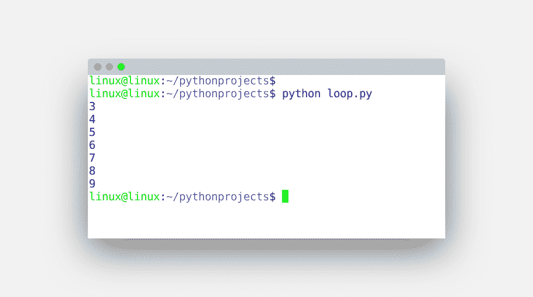
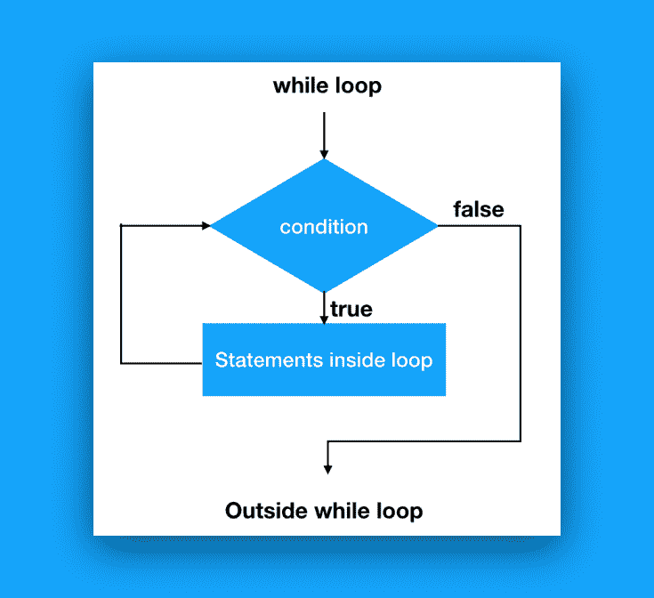

# While 循环

> 原文： [https://pythonbasics.org/while-loop/](https://pythonbasics.org/while-loop/)

while 循环重复执行代码，直到满足条件为止。 与 for 循环不同，其中的迭代次数可能是未知的。 while 循环始终由条件和代码块组成。

与总是具有有限可数步数的 for 循环相反，while 循环仅在条件为 true 时才结束。

**相关课程：** [完整的 Python 编程课程&练习](https://gum.co/dcsp)

## 范例

### While 循环示例

下面的 while 循环定义了条件（x &lt; 10），并重复指令直到该条件成立。 输入此代码：

```py
#!/usr/bin/python

x = 3                              
while x < 10:
    print(x)
    x = x + 1

```

Executes the code below until the condition x < 10 is met. Unlike a for loop, the iterator i is increased in the loop.

保存然后使用您的 Python IDE 或从终端运行。



您也可以创建无限循环，这是条件永远不变的时候。

```py
while True:
    print('Forever')

```

在正常情况下，您希望程序在某个时候退出 while 循环。 如果条件发生变化，程序将自动退出 while 循环。 大多数情况下，这是通过迭代器完成的，但也可以通过布尔值（开关）来完成。

### 控制流程图

示意性地，while 循环如下图所示。 这称为控制流程图（cfg）。 进入 while 循环时发生情况的直观方式。

应该注意的是，while 循环中可以有多个语句。 如果代码变得很长，您还可以从循环内部调用函数。



## 练习

请尝试以下练习：

1.编写一个程序，使用 while 循环列出下面的国家/地区。

```py
clist = ["Canada","USA","Mexico"]

```

2\. while 循环和 for 循环有什么区别？
3.您可以在 while 循环中对数字求和吗？
4.可以在 while 循环内使用 for 循环吗？

[下载示例](https://gum.co/dcsp)