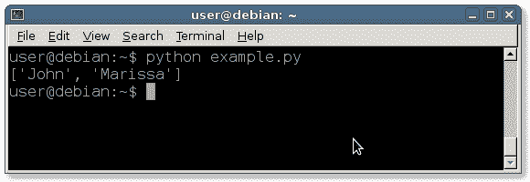

# 切片

> 原文： [https://pythonbasics.org/slices/](https://pythonbasics.org/slices/)

可以从字符串或列表中获取切片，就像从比萨中获取切片一样。如果要包含一部分变量，可以是列表或字符串，则无需重新定义。

您可以获取变量的副本，该副本是原始变量的全部或子集。 此概念称为切片。


## 示例

### 切片

要拍摄前两个切片，请使用：

```py
slice = pizza[0:2]

```

可变切片现在将包含一份比萨饼，但仅一部分。 这用方括号表示，第一个数字是开始，而冒号之后的数字是结束。

为什么从零开始？

Python 从零开始而不是从 1 开始对字符串和列表元素编号。

在这种情况下，我们从比萨饼列表中获取了一个切片，将输出存储到新变量中。如果需要，可以将其直接传递给打印功能。

### 列表切片

创建人员列表。 我们将使用切片技术来获取列表中的前两个人。

```py
#!/usr/bin/python
persons = [ "John", "Marissa", "Pete", "Dayton" ]

slice = persons[0:2]
print(slice)

```

这将输出切片：



### 字符串切片

字符串也可以切片。 这样做的方式完全相同，但主要区别在于它不会返回很多项目，而只是返回一个新字符串。

```py
destination = "summer holiday at beach"
mySlice = destination[0:6]
print(mySlice)

```

## 练习

试试下面的练习

1.  请从下面的列表中获取切片：
    
    `pizzas = ["Hawai","Pepperoni","Fromaggi","Napolitana","Diavoli"]`

2.  给定文本`"Hello World"`，请截取`"World"`

[下载示例](https://gum.co/dcsp)