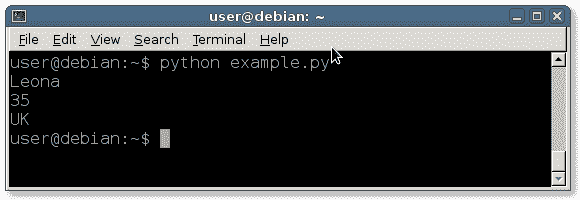

# 多个返回值

> 原文： [https://pythonbasics.org/multiple-return/](https://pythonbasics.org/multiple-return/)

Python 函数可以返回多个变量。 这些变量可以直接存储在变量中。 一个函数不需要返回一个变量，它可以返回零个，一个，两个或多个变量。

这是 Python 的唯一属性，默认情况下，其他编程语言（例如 C ++或 Java）不支持此属性。

**相关课程：** [完整的 Python 编程课程&练习](https://gum.co/dcsp)

## 示例

### 简介

函数中定义的变量仅在函数中已知。 那是因为变量的范围。 通常，除非您要在程序中使用函数输出，否则这不是问题。

在这种情况下，您可以从函数中返回变量。 在最简单的情况下，您可以返回一个变量：

```py
def complexfunction(a,b):
    sum = a +b
    return sum

```

用 complexfunction（2,3）调用该函数，并且可以使用或保存其输出。

但是，如果要访问的函数中有多个变量怎么办？

### 多个返回值

创建一个函数 getPerson（）。 如您所知，一个函数可以返回一个变量，但也可以返回多个变量。

我们将直接从函数调用中存储所有这些变量。

```py
#!/usr/bin/env python3

def getPerson():
    name = "Leona"
    age = 35
    country = "UK"
    return name,age,country

name,age,country = getPerson()
print(name)
print(age)
print(country)

```

这将输出：



## 练习

请尝试以下练习：

1.  创建一个返回 a，b 和 a + b 的函数
2.  创建一个返回 5 个变量的函数

完成这些步骤后，继续下一个练习。

[下载示例](https://gum.co/HhgpI)