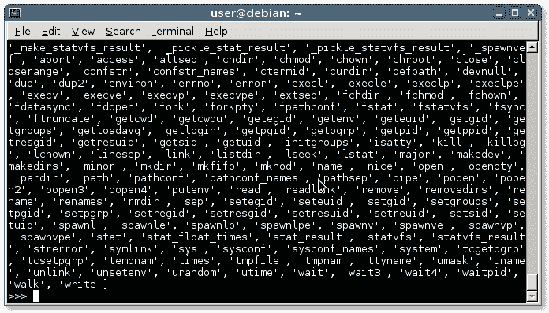

# 模组

> 原文： [https://pythonbasics.org/modules/](https://pythonbasics.org/modules/)

模块可以具有一个或多个功能。 他们可以帮助您组织代码。 您可以有多个文件（模块），而不是一个长的 Python 文件。

模块是具有功能或类的 Python 文件。 Python 程序可以使用一个或多个模块。


## 示例

### 什么是模块？

有许多可用于 Python 的模块（有时称为库）。 通过使用这些模块，您可以更快地进行编码。

将它们视为构建基块，它们包含大量为您提供其他功能的功能（有时是类）。

### 导入模块

您可以使用 **import** 关键字加载模块。

在下面的示例中，我们加载 _os 模块 _。 这是操作系统的缩写，因此您可以执行系统任务。

```py
import os
os.system("dir")

```

使用该模块，我们调用其名为系统的功能之一（运行命令）。

在这种情况下，它将仅列出目录中的文件（dir 命令）。

Python 有许多可用的模块。

### 从模块获取特定功能

要在模块中导入特定功能，可以使用以下行：

```py
from module import function

```

有一个名为 _time_ 的模块，该模块具有各种时间功能：获取日期，小时，分钟，秒等。 有很多功能。

假设您希望程序等待 2 秒。 如果需要，可以导入特定功能而不是整个模块。

```py
#!/usr/bin/python
from time import sleep
sleep(2)

```

### 从模块导入所有功能。

您可以从模块导入所有功能，但是不建议这样做。
下面的示例导入整个时间模块（所有功能），然后可以使用。

```py
#!/usr/bin/python
from time
time.sleep(2)

```

### 模块中的列表功能

要查看模块中的所有功能，请启动 Python 解释器并输入

```py
python
import os
dir(os)

```

这将显示模块中的所有函数和类：



### 制作模块

要制作模块，请创建一个 Python 文件。 然后像导入其他模块一样将其导入。
创建您的模块（fruit.py）

```py
def lemon():
    print('Lemonade')

```

然后创建您的程序（example.py）并调用该函数：

```py
import fruit

fruit.lemon()

```

### 找不到  python 模块

如果收到错误“ ImportError：没有名为&lt;name&gt;的模块”，则表示未安装该模块。
您可以使用 pip 软件包管理器安装模块。 为此，最好也设置一个 virtualenv。&lt;/name&gt;

```py
virtualenv projectname
cd projectname
source bin/activate
pip install module

```

## 练习

试试下面的练习

1.  导入数学模块并调用 sin 函数
2.  使用函数 snake（）创建自己的模块

[下载示例](https://gum.co/HhgpI)