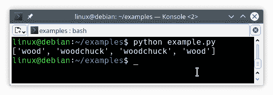

# 常用表达

> 原文： [https://pythonbasics.org/regular-expressions/](https://pythonbasics.org/regular-expressions/)

re 模块处理 Python 中的正则表达式

正则表达式可用于查找字符串中的所有匹配项，或仅测试匹配项是否存在。

正则表达式可以帮助您快速地从大量数据中收集一些项目，只需定义一些语法规则即可。

**相关课程：** [完整的 Python 编程课程&练习](https://gum.co/dcsp)

## 示例

创建一个字符串以运行正则表达式。 作为示例短语，我们将使用美国著名的绕口令“ wouldchuck”。

使用正则表达式查找字符串的所有匹配项。 使用正则表达式和搜索空间作为参数调用方法 findall（）。

请尝试以下程序：

```py
import re

string = "How much wood would a woodchuck chuck if a woodchuck could chuck wood?"

matches = re.findall(r'woo\w*', string)
print(matches)

```

它返回正则表达式的匹配项。
我们定义起始字母“ woo”，后跟匹配零次或多次*的单词字符\ w。



要测试数据是否匹配正则表达式，请使用搜索方法。 返回 true 或 false，可以与 if 语句匹配：

```py
if re.search(r'woo\w*', string):
    print('woo\w* foud!')
else:
    print('not found')

```

如果要编写自己的正则表达式，请签出此[备忘单](https://i.pinimg.com/originals/07/62/db/0762dbbeef53ee102ee9ca2e4df6bda0.jpg)。

## 练习

1.  找出正则表达式是否区分大小写
2.  为电话号码创建正则表达式

[下载示例](https://gum.co/HhgpI)