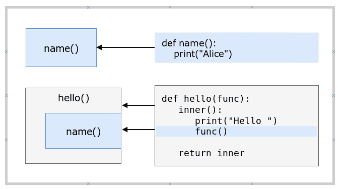

# 装饰工

> 原文： [https://pythonbasics.org/decorators/](https://pythonbasics.org/decorators/)

在本教程中学习 **Python 装饰器**。

使用装饰器向现有功能添加功能。 这称为元编程。

一个函数可以将一个函数作为参数（_ 要修饰的函数 _），并返回带或不带扩展名的相同函数。

扩展功能有时非常有用，我们将在本文稍后展示真实的示例。

**相关课程：** [完整的 Python 编程课程&练习](https://gum.co/dcsp)

### 函数是对象

在 Python 中，一切都是对象，包括函数。 这意味着函数可以传递并返回。 当您看到它时，乍一看可能很奇怪：

```py
def hello():                                                                                                
    print("Hello")                                                                                          

# even functions are objects                                                                                
message = hello                                                                                             

# call new function                                                                                         
message()          

```

调用 message（）或 hello（）方法，它们具有相同的输出。 那是因为他们指的是同一个对象。

现在让我们继续装饰。

## 装饰器

### 示例

装饰器接受一个函数，对其进行扩展并返回。 是的，**函数可以返回函数**。

```py
def hello(func):                                                                                            
    def inner():                                                                                            
        print("Hello ")                                                                                     
        func()                                                                                              
    return inner                                                                                            

def name():                                                                                                 
    print("Alice")                                                                                          

obj = hello(name)                                                                                           
obj()          

```

在上面的示例中，hello（）是装饰器。

在
语句中

```py
obj = hello(name)          

```

the function name() is decorated by the function hello().

它将功能包装在另一个功能中。



### 示例 2

可以通过包装功能来扩展它们。

```py
def who():                                                                                                  
    print("Alice")                                                                                          

def display(func):                                                                                          
    def inner():                                                                                            
        print("The current user is : ", end="")                                                             
        func()                                                                                              
    return inner                                                                                            

if __name__ == "__main__":                                                                                  
    myobj = display(who)                                                                                    
    myobj()       

```

who（）函数由 display（）装饰。

### 语法糖

装饰器是常见的，可以简化。 尽管功能完全相同，但代码更简洁。

Python 可以使用 **@符号**简化装饰器的使用。

```py
@hello                                                                                                      
def name():                                                                                                 
    print("Alice")                                                                                          

if __name__ == "__main__":                                                                                  
    name()                          

```

这将输出完全相同的内容，但是是编写代码的更简洁的方法。

跟我在一起。 通话

```py
@hello                                                                                                      
def name():   

```

is just a simpler way of writing:

```py
obj = hello(name)          

```

在这两种情况下，我们都将装饰器应用于函数。

### 参数

参数可以与装饰器一起使用。 如果您有一个打印总和 a + b 的功能，例如

```py
def sumab(a,b):                                                                                             
    summed = a + b                                                                                          
    print(summed)

```

您可以将其包装在装饰器函数中。
以下示例显示了如何执行此操作：

```py
def pretty_sumab(func):                                                                                     
    def inner(a,b):                                                                                         
        print(str(a) + " + " + str(b) + " is ", end="")                                                     
        return func(a,b)                                                                                    

    return inner                                                                                            

@pretty_sumab                                                                                               
def sumab(a,b):                                                                                             
    summed = a + b                                                                                          
    print(summed)                                                                                      

if __name__ == "__main__":                                                                                  
    sumab(5,3)             

```

函数 sumab 由函数 pretty_sumab 包装。 这用其上方的@符号表示。

调用函数 sumab，并查看带有参数的函数 sumab 和 pretty_sumab 的逻辑都已运行。

### 真实示例

**用例：时间测量**


装饰器可用于测量函数执行所需的时间。

如果您定义了一个休眠的简单函数，则

```py
def myFunction(n):                                                                                                        
  time.sleep(n)                                                                                                           

```

然后，您只需添加@measure_time 行即可测量所需的时间

下面的例子：

```py
import time                                                                                                               

def measure_time(func):                                                                                                   

  def wrapper(*arg):                                                                                                      
      t = time.time()                                                                                                     
      res = func(*arg)                                                                                                    
      print("Function took " + str(time.time()-t) + " seconds to run")                                                    
      return res                                                                                                          

  return wrapper                                                                                                          

@measure_time                                                                                                             
def myFunction(n):                                                                                                        
  time.sleep(n)                                                                                                           

if __name__ == "__main__":                                                                                                
    myFunction(2)      

```

这将输出执行函数 myFunction（）所花费的时间。 很酷的事情是，通过添加一行代码 _@measure_time_ ，我们现在可以测量程序执行时间。


**用例：Web 应用程序**
让我们以 Web 应用程序的使用案例为例。 在 Flask 中构建 Web 应用程序时，您始终会编写网址路由。

每条路线都是 Web 应用程序中的特定页面。
打开页面/ about 可以调用 about_page（）方法。

```py
@app.route("/about")
def about_page():
  return "Website about nachos"

```

在这种情况下，它使用@符号进行装饰。

[下载示例和练习](https://gum.co/dcsp)