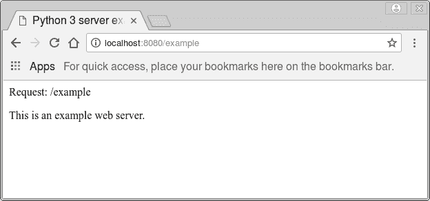

# 网络服务器

> 原文： [https://pythonbasics.org/webserver/](https://pythonbasics.org/webserver/)

Python 中的网络服务器可以通过两种方式设置。 Python 开箱即用地支持 Web 服务器。 您可以使用一个衬垫启动 Web 服务器。

但是，您也可以创建具有独特功能的自定义 Web 服务器。 在本文中，您将学习如何做到这一点。

此示例中的 Web 服务器只能在本地网络上访问。 它可以是 localhost 或其他网络主机。 您可以使用 VPN 跨位置投放。

**相关课程：** [完整的 Python 编程课程&练习](https://gum.co/dcsp)

## 范例

### 内置网络服务器

要启动网络服务器，请运行以下命令：

```py
python3 -m http.server

```

这将在端口 8080 上打开 Web 服务器。然后，您可以在 [http://127.0.0.1:8080/](http://127.0.0.1:8080/) 中打开浏览器。

也可以使用您的 192.168 .-.-地址通过网络访问 Web 服务器。

这是默认服务器，可用于从计算机下载文件。

### Web 服务器

运行以下代码以启动自定义 Web 服务器。 要创建自定义 Web 服务器，我们需要使用 HTTP 协议。

通过设计，http 协议有一个“获取”请求，该请求返回服务器上的文件。 如果找到该文件，它将返回 200。

服务器将从端口 8080 开始，并接受默认的 Web 浏览器请求。

```py
# Python 3 server example
from http.server import BaseHTTPRequestHandler, HTTPServer
import time

hostName = "localhost"
serverPort = 8080

class MyServer(BaseHTTPRequestHandler):
    def do_GET(self):
        self.send_response(200)
        self.send_header("Content-type", "text/html")
        self.end_headers()
        self.wfile.write(bytes("<html><head><title>https://pythonbasics.org</title></head>", "utf-8"))
        self.wfile.write(bytes("<p>Request: %s</p>" % self.path, "utf-8"))
        self.wfile.write(bytes("<body>", "utf-8"))
        self.wfile.write(bytes("<p>This is an example web server.</p>", "utf-8"))
        self.wfile.write(bytes("</body></html>", "utf-8"))

if __name__ == "__main__":        
    webServer = HTTPServer((hostName, serverPort), MyServer)
    print("Server started http://%s:%s" % (hostName, serverPort))

    try:
        webServer.serve_forever()
    except KeyboardInterrupt:
        pass

    webServer.server_close()
    print("Server stopped.")

```

如果打开类似 [http://127.0.0.1/example](http://127.0.0.1/example) 的网址，则会调用 do_GET（）方法。 我们通过这种方法手动发送网页。



变量 self.path 返回所请求的 Web 浏览器 URL。 在这种情况下，它将是/ example

[下载示例和练习](https://gum.co/dcsp)