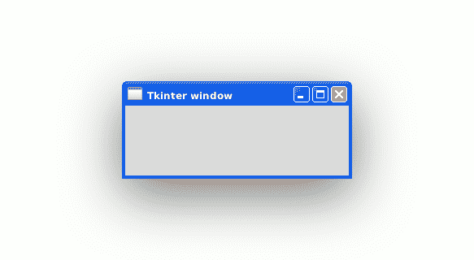

# Tkinter

> 原文： [https://pythonbasics.org/tkinter/](https://pythonbasics.org/tkinter/)

Tkinter 是 Python 的图形用户界面（GUI）模块，您可以使用 Python 制作桌面应用程序。 您可以制作窗口，按钮，显示文字和图像等。

Tk 和 Tkinter 应用程序可以在大多数 Unix 平台上运行。 这也适用于 Windows 和 Mac OSX。
模块 Tkinter 是 Tk GUI 工具包的接口。

**相关课程：** [带有 Tkinter 的 Python 桌面应用程序](https://gum.co/ErLc)

## 范例

### Tkinter 模块

本示例打开一个空白的桌面窗口。 tkinter 模块是标准库的一部分。
要使用 tkinter，请导入 tkinter 模块。

```
from tkinter import *

```

这是带有下划线 t 的 tkinter，在 Python 3 中已重命名。

### 设置窗口

启动 tk 并创建一个窗口。

```
root = Tk()
app = Window(root)

```

window 类不是标准的，我们创建一个 Window。 此类本身非常基础。

```
class Window(Frame):
    def __init__(self, master=None):
        Frame.__init__(self, master)
        self.master = master

```

然后设置窗口标题并显示该窗口：

```
# set window title
root.wm_title("Tkinter window")

# show window
root.mainloop()

```



### Tkinter 窗口示例

下面的程序显示了一个空的 tkinter 窗口。
使用以下程序运行：

```
from tkinter import *

class Window(Frame):
    def __init__(self, master=None):
        Frame.__init__(self, master)
        self.master = master

# initialize tkinter
root = Tk()
app = Window(root)

# set window title
root.wm_title("Tkinter window")

# show window
root.mainloop()

```

[下载 Tkinter 示例](https://gum.co/ErLc)