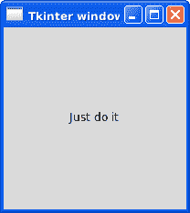
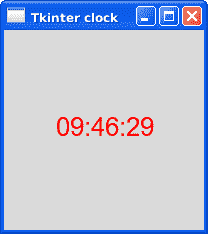

# Tkinter 标签

> 原文： [https://pythonbasics.org/tkinter-label/](https://pythonbasics.org/tkinter-label/)

tkinter 标签窗口小部件可用于在屏幕上显示文本或图像。 标签只能显示单一字体的文本。 文本可以跨越多行。

您可以在标签中放置任何文本，并且在窗口中可以具有多个标签（就像在窗口中可以多次放置任何小部件一样）。


## 示例

### 简介

只需两行代码即可添加标签。 第一行定义标签和文本。 第二行设置二维位置：

```py
text = Label(self, text="Just do it")
text.place(x=70,y=90)

```

您可以更改字体颜色或标签大小：

```py
label1 = Label(master, text="Tkinter", fg="red")
label1 = Label(master, text="Helvetica", font=("Helvetica", 18))

```



### Tkinter 标签示例

本示例在屏幕上显示一个标签。 这是 tkinter 著名的“ hello world”程序，但是我们决定更改文本。

如果您没有为标签窗口小部件指定大小，则将其大小设置为足以适合文本的大小。

```py
from tkinter import *

class Window(Frame):
    def __init__(self, master=None):
        Frame.__init__(self, master)
        self.master = master
        self.pack(fill=BOTH, expand=1)

        text = Label(self, text="Just do it")
        text.place(x=70,y=90)
        #text.pack()

root = Tk()
app = Window(root)
root.wm_title("Tkinter window")
root.geometry("200x200")
root.mainloop()

```

### Tkinter 时钟

tkinter 标签正在使用双缓冲技术。 此技术可防止在更新屏幕时轻拂屏幕。

您可以说一个时钟每秒更新一次，但不会看到任何闪烁。 该技术目前非常标准，我们不希望在 GUI 窗口中有任何滑动。

时钟可以简单地添加一个计时器功能，如下所示：

```py
from tkinter import *
import time

class App(Frame):
    def __init__(self,master=None):
        Frame.__init__(self, master)
        self.master = master
        self.label = Label(text="", fg="Red", font=("Helvetica", 18))
        self.label.place(x=50,y=80)
        self.update_clock()

    def update_clock(self):
        now = time.strftime("%H:%M:%S")
        self.label.configure(text=now)
        self.after(1000, self.update_clock)

root = Tk()
app=App(root)
root.wm_title("Tkinter clock")
root.geometry("200x200")
root.after(1000, app.update_clock)
root.mainloop()

```

那将显示此时钟自动更新：



[下载 Tkinter 示例](https://gum.co/ErLc)