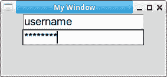

# tkinter 条目

> 原文： [https://pythonbasics.org/tkinter_entry/](https://pythonbasics.org/tkinter_entry/)

使用 tkinter 输入框，您可以在桌面软件中输入文本。 通常，输入框（输入字段）会带有标签，这是因为如果没有标签，则不清楚用户应该在此处键入什么内容。

您可以添加多个输入字段。 输入字段可以显示拉丁字符，但也可以显示其他类型的输入（例如密码）

**相关课程：** [带有 Tkinter 的 Python 桌面应用程序](https://gum.co/ErLc)

## 条目

### tkinter 条目

使用 tkinter 输入框可以输入 GUI。 下面的代码将一个输入框添加到 GUI。 第一个参数是要添加的内容，文本参数定义了要放置在其旁边的内容。

```py
#!/usr/bin/python
# -*- coding: UTF-8 -*-

from tkinter import *

top = Tk()
L1 = Label(top, text="Label")
L1.pack(side=LEFT)
E1 = Entry(top, bd=5)
E1.pack(side=RIGHT)

top.mainloop()

```


### tkinter 输入密码

tkinter 条目可以是纯文本，但也支持密码输入。 通过更改参数 show，可以使其看起来像您想要的任何东西。

```py
#!/usr/bin/env python
# -*- coding: utf-8 -*-

import tkinter as tk

window = tk.Tk()
window.title('My Window')
window.geometry('500x300') 

e1 = tk.Entry(window, show=None, font=('Arial', 14))  
e2 = tk.Entry(window, show='*', font=('Arial', 14))   
e1.pack()
e2.pack()

window.mainloop()

```



[下载 Tkinter 示例](https://gum.co/ErLc)