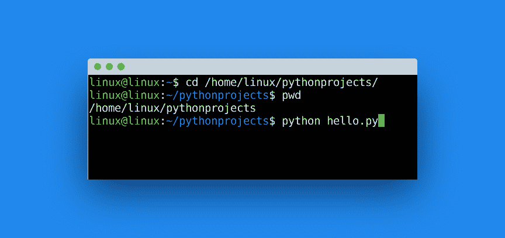
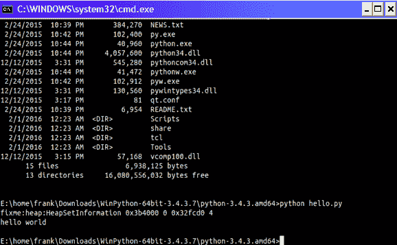

# 执行 Python 脚本

> 原文： [https://pythonbasics.org/execute-python-scripts/](https://pythonbasics.org/execute-python-scripts/)

在终端或 IDE 中执行 Python 脚本。 Python 文件具有 **.py** 扩展名。 每当您制作 Python 脚本时，都将其另存为 name.py

下面显示了一个简单程序（hello.py）。 第一行表明我们要使用 Python 解释器。 第三行在屏幕上输出一行文本“ hello wlrd”。

可以将以下文本复制到文本编辑器中，并另存为 **hello.py。** Python 使用以 **.py** 结尾的文件。

```py
#!/usr/bin/env python3

print('hello world')

```

您可以使用任何文本编辑器来创建 Python 程序。 我建议使用支持语法高亮显示（文本着色）和行号的文本编辑器。


## 运行 Python

### 从终端运行

您可以使用终端或命令行启动 Python 程序。 这适用于所有平台（Mac OS，Windows，Linux）。

要在 Windows 上打开终端：按 Windows 键+ R 键（运行程序），键入 cmd 或 command，然后按 Enter 键。

在 Mac OS 上，使用 finder 启动终端。 您可以按 Command +空格键并键入 terminal，然后按 Enter。

#### 启动程序

要**启动**程序，我们必须打开命令行并键入：

```py
python hello.py

```

为此，您需要位于正确的目录中。 也就是说，您的 python 程序所在的目录。

在 Mac OS 和 Linux 上，您可以使用命令 _pwd_ 查看当前目录。
如果使用 Windows，则目录显示在命令行标题 bra 中。

要更改目录，请使用“ cd”命令，例如“ cd / home / user / pythonprojects”或“ cd C：\ Projects \”。



### 从 IDE 运行

要从 IDE 运行 Python 脚本，请先启动一个项目。 创建项目后，添加您的.py 文件（或在 IDE 中创建它们），然后按运行。

在 PyCharm IDE 中：

*   开始项目
    *   欢迎屏幕打开，单击创建新项目。
    *   在主菜单上，选择“文件” |“其他”。 新项目。
*   选择 Python 解释器
    *   从列表中选择 Python 版本。 使用 3.x
*   点击创建
*   添加新的 Python 文件（新文件）并添加 hello.py
*   单击绿色三角形以启动程序。 另一个选择是在 Python 文件上单击鼠标右键，然后选择“运行”。

其他 IDE 具有运行 Python 程序的类似过程（启动项目，添加文件，运行按钮）。

## 输出

您应该看到一行显示“ hello world”的文本。


## 练习

请尝试以下练习：

1.  制作一个可以打印您的姓名的 Python 程序。
2.  制作一个显示歌曲歌词的程序。

完成这些步骤后，继续下一个练习。

[下载示例](https://gum.co/dcsp)