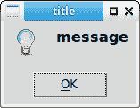
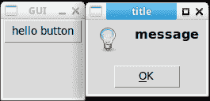

# tkinter 消息框

> 原文： [https://pythonbasics.org/tkinter_messagebox/](https://pythonbasics.org/tkinter_messagebox/)

消息框是一个显示消息的小弹出窗口。 有时它伴随着一个图标。 几乎所有时间，它都会中断用户的操作。

下面的示例向您展示如何使用 tkinter 创建和使用消息框。 此处显示的代码适用于 Python 3.x 和更高版本。 较旧的 Python 导入和使用 tkinter 的方式有所不同。


## 消息框

### 消息框

消息框有很多变体。 您可以有一条信息消息，警告消息或错误消息。 所有这些消息框都有标题和消息。

```py
#!/usr/bin/python3
import tkinter
import tkinter.messagebox

tkinter.messagebox.showinfo('title','message')
tkinter.messagebox.showwarning('title','message')
tkinter.messagebox.showerror('title','message')

```



### 点击  消息框

下面的示例仅在单击按钮时显示一个消息框。 这类似于现实世界中出现问题时显示消息框的情况。

```py
import tkinter
import tkinter.messagebox

def buttonClick():
    tkinter.messagebox.showinfo('title', 'message')
    #tkinter.messagebox.showwarning('title', 'message')
    #tkinter.messagebox.showerror('title', 'message')

root=tkinter.Tk()
root.title('GUI')  
root.geometry('100x100')  
root.resizable(False, False)  
tkinter.Button(root, text='hello button',command=buttonClick).pack()
root.mainloop()

```



[下载 Tkinter 示例](https://gum.co/ErLc)