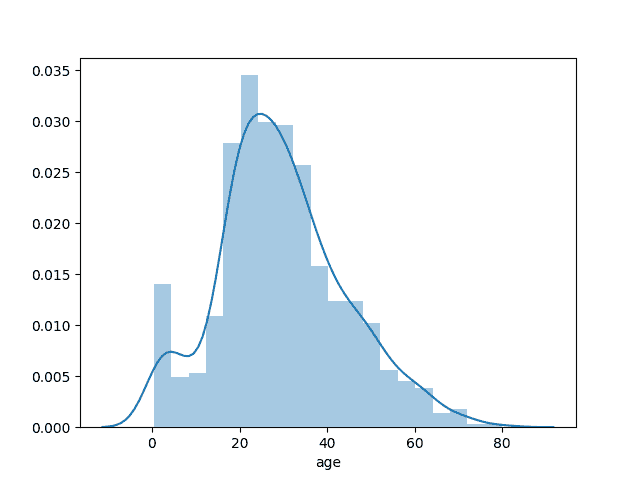
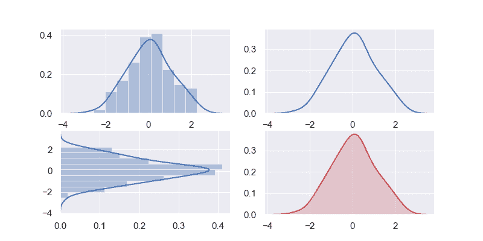
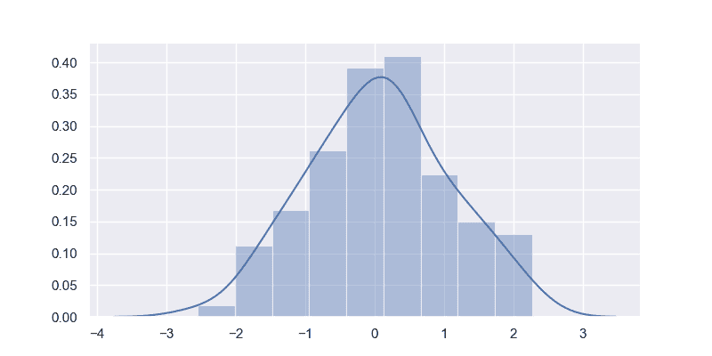
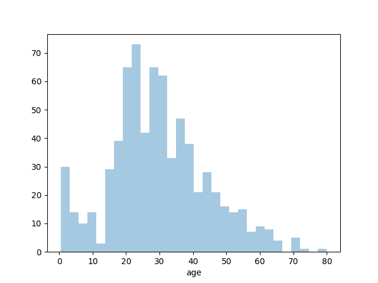
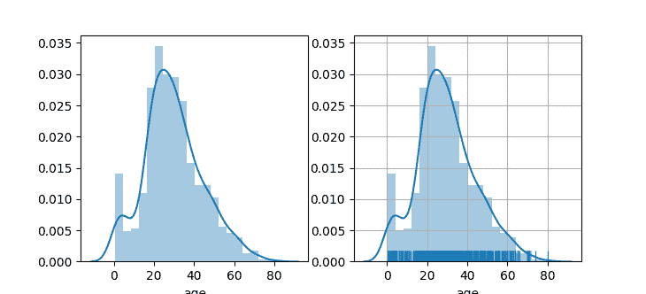

# Seaborn `distplot`

> 原文： [https://pythonbasics.org/seaborn-distplot/](https://pythonbasics.org/seaborn-distplot/)

通过 Seaborn distplot，您可以显示带有线条的直方图。 这可以以各种变化形式显示。 我们将 seaborn 与 Python 绘图模块 matplotlib 结合使用。

分布图绘制观测值的单变量分布。 distplot（）函数将 matplotlib hist 函数与 seaborn kdeplot（）和 rugplot（）函数结合在一起。


## 示例

### `distplot`示例

下图显示了一个简单的分布。 它使用 random.randn（）创建随机值。
如果您也手动定义值，它将起作用。

```py
import matplotlib.pyplot as plt
import seaborn as sns, numpy as np

sns.set(rc={"figure.figsize": (8, 4)}); np.random.seed(0)
x = np.random.randn(100)
ax = sns.distplot(x)
plt.show()

```



### `distplot`示例

您可以显示 distplot 的各种变化。 我们使用 pylab 模块中的 subplot（）方法来一次显示 4 种变化。

通过更改 distplot（）方法中的参数，您可以创建完全不同的视图。 您可以使用这些参数来更改颜色，方向等。

```py
import matplotlib.pyplot as plt
import seaborn as sns, numpy as np
from pylab import *

sns.set(rc={"figure.figsize": (8, 4)}); np.random.seed(0)
x = np.random.randn(100)

subplot(2,2,1)
ax = sns.distplot(x)

subplot(2,2,2)
ax = sns.distplot(x, rug=False, hist=False)

subplot(2,2,3)
ax = sns.distplot(x, vertical=True)

subplot(2,2,4)
ax = sns.kdeplot(x, shade=True, color="r")

plt.show()

```



[下载示例](https://gum.co/mpdp)

### Seaborn 分布

您也可以在直方图中显示 seaborn 的标准数据集。
这是一个很大的数据集，因此仅占用一列。

```py
import matplotlib.pyplot as plt
import seaborn as sns

titanic=sns.load_dataset('titanic')    
age1=titanic['age'].dropna()
sns.distplot(age1)         
plt.show()

```



### `distplot`容器

如果您想更改垃圾桶的数量或隐藏行，也可以。
当调用方法 distplot9）时，您可以传递箱数并告诉线（kde）不可见。

```py
import matplotlib.pyplot as plt
import seaborn as sns

titanic=sns.load_dataset('titanic')    
age1=titanic['age'].dropna()
sns.distplot(age1,bins=30,kde=False)
plt.show()

```



### Seaborn 不同的绘图

下面的示例显示了其他一些分布图示例。 您通过 grid（True）方法调用激活了一个网格。

```py
import matplotlib.pyplot as plt
import seaborn as sns

titanic=sns.load_dataset('titanic')    
age1=titanic['age'].dropna()

fig,axes=plt.subplots(1,2)
sns.distplot(age1,ax=axes[0])
plt.grid(True)
sns.distplot(age1,rug=True,ax=axes[1])
plt.show()

```



[Download examples](https://gum.co/mpdp)