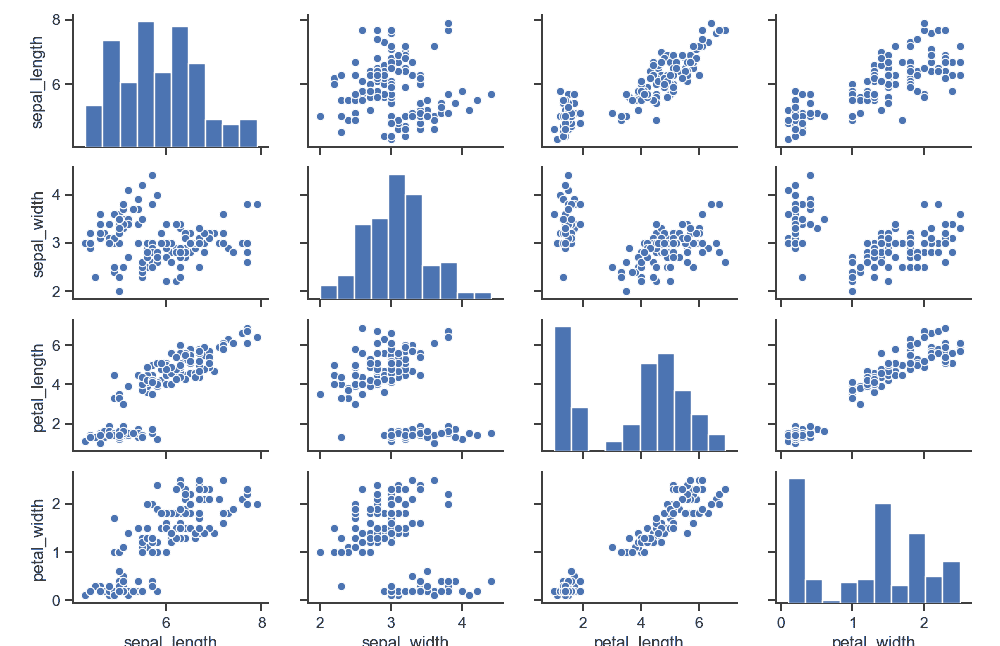

# Seaborn 对图

> 原文： [https://pythonbasics.org/seaborn_pairplot/](https://pythonbasics.org/seaborn_pairplot/)

pairplot 函数创建一个 Axes 网格，以便数据中的每个变量在单行的 y 轴和单列的 x 轴上共享。 如下所示创建图。

**相关课程：** [Matplotlib 示例和视频课程](https://gum.co/mpdp)

## 对图

### 对图

对图显示在下方。 它使用鸢尾花数据集。 数据集有 4 个测量值：萼片宽度，萼片长度，petal_length 和 petal_width。 数据映射在下面的网格中。 由于有 4 个测量值，因此会创建一个 4x4 的图。

```py
#!/usr/bin/python3

import seaborn as sns

sns.set(style="ticks", color_codes=True)
iris = sns.load_dataset("iris")
g = sns.pairplot(iris)

import matplotlib.pyplot as plt
plt.show()

```



如果您希望使用较小的绘图，请使用较少的变量。 例如，如果只需要 sepal_width 和 sepal_length，则 tha 将创建 2x2 的图。

```py
g = sns.pairplot(iris, vars=["sepal_width", "sepal_length"])

```

您可以更改分布的形状。

```py
g = sns.pairplot(iris, diag_kind="kde")

```