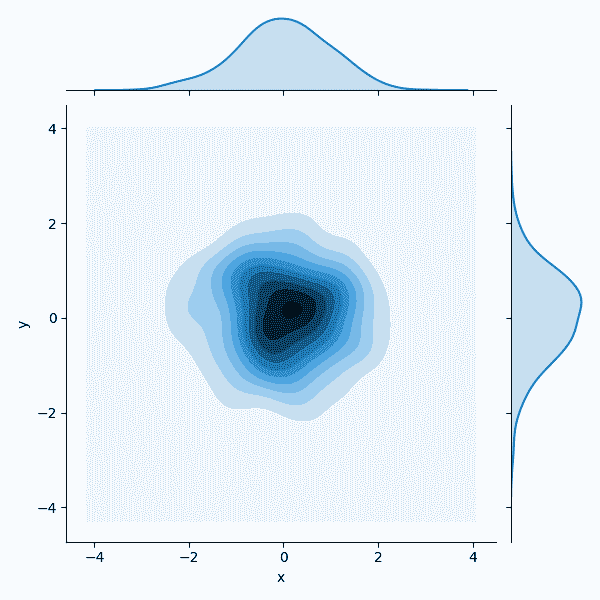

# Seaborn 大熊猫

> 原文： [https://pythonbasics.org/seaborn_pandas/](https://pythonbasics.org/seaborn_pandas/)

Pandas 是一个数据分析和处理模块，可帮助您加载和解析数据。 这是您在创建绘图时可能会使用的模块。

在熊猫中，数据存储在数据帧中。 例如，如果您从 Excel 加载数据。 当然，在处理数据时，您不必使用 Pandas，就像在旅行时不必使用汽车一样。 但这使处理数据变得更加容易。

**相关课程：** [Matplotlib 示例和视频课程](https://gum.co/mpdp)

## 示例

### 熊猫

从熊猫数据框创建海洋熊猫图。 数据框使用随机数据，但实际上，这些数据通常来自数据库，Excel 或其他来源。

该程序会创建不同的图，但为简单起见，仅显示一个结果。

```py
import numpy as np
import pandas as pd
from scipy import stats
import matplotlib.pyplot as plt
import seaborn as sns

df_obj1 = pd.DataFrame({"x": np.random.randn(500),
                   "y": np.random.randn(500)})

df_obj2 = pd.DataFrame({"x": np.random.randn(500),
                   "y": np.random.randint(0, 100, 500)})

sns.jointplot(x="x", y="y", data=df_obj2)
sns.jointplot(x="x", y="y", data=df_obj2, kind="hex");
sns.jointplot(x="x", y="y", data=df_obj1, kind="kde");
dataset = sns.load_dataset("tips")
sns.pairplot(dataset);

#titanic = sns.load_dataset('titanic')
#planets = sns.load_dataset('planets')
#flights = sns.load_dataset('flights')
#iris = sns.load_dataset('iris')
exercise = sns.load_dataset('exercise')
sns.stripplot(x="diet", y="pulse", data=exercise)
sns.swarmplot(x="diet", y="pulse", data=exercise, hue='kind')
sns.boxplot(x="diet", y="pulse", data=exercise)
sns.boxplot(x="diet", y="pulse", data=exercise, hue='kind')
sns.violinplot(x="diet", y="pulse", data=exercise, hue='kind')
sns.barplot(x="diet", y="pulse", data=exercise, hue='kind')
sns.pointplot(x="diet", y="pulse", data=exercise, hue='kind');

plt.show()

```

