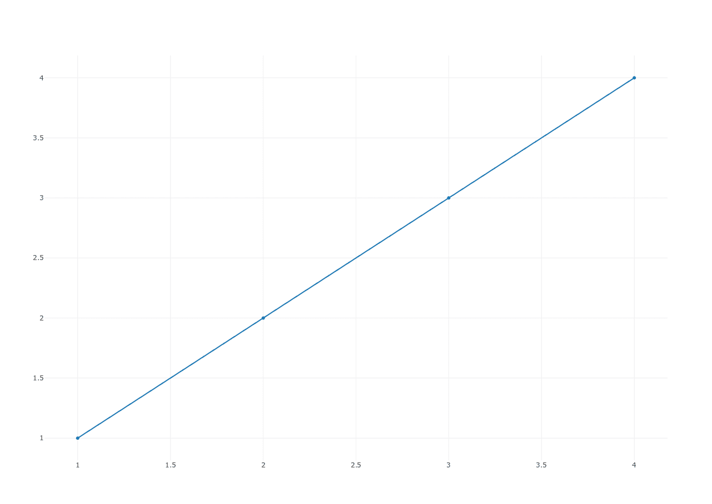

# 密谋

> 原文： [https://pythonbasics.org/plotly/](https://pythonbasics.org/plotly/)

Plotly 是 Python 的制图模块。 它可以创建出版物质量的图表。 它支持多种类型的图表/图表，包括折线图，条形图，气泡图等。

该库是免费的开放源代码。 在本教程中，您将学习如何使用 plot.ly 创建折线图。 可以将其视为 matplotlib 的更广泛的替代方案。

**相关课程：** [Matplotlib 示例和视频课程](https://gum.co/mpdp)

## 示例

### 简介

从 PyPi 仓库中安装。 在新安装的虚拟环境中，您可以使用程序 pip 进行安装。

```py
pip install plotly

```

Plotly 提供了用于绘制图表的 Web 服务。 图形将保存在您的在线 Plotly 帐户中。 这是可选的，Plotly 可以脱机使用。

离线绘图有两个选项：

*   使用 plotly.offline.plot（）创建和独立的 HTML。 可以在浏览器中打开该文件

*   在 Jupyter Notebook 中脱机工作时，请使用 plotly.offline.iplot（）。

### 在线剧情

在线地块需要在 [plot.ly](https://plot.ly) 上进行计费。

更改为您的用户名和 [API 密钥](https://plot.ly/settings/api)

打开文件〜/ .plotly / .credentials 并更新您的 API 密钥。

然后创建此程序：

```py
import plotly.plotly as py
import plotly.graph_objs as go
import numpy as np

py.sign_in(username='voorbeeld', api_key='L0McCrDpID71OLCEgRtK')

mx = [1, 2, 3, 4]
my = [1, 2, 3, 4]

trace = go.Scatter(
    x = mx,
        y = my
	)

data = [trace]
py.plot(data)

```

从终端运行程序。 然后打开 URL [https://plot.ly/organize/home/#/](https://plot.ly/organize/home/#/) ，您的图表将在其中显示。



### ")独立 HTML（plotly.offline.plot）

下面的代码创建一个新的 HTML 文件。 使用浏览器（Firefox，Chrome）打开时，此 HTML 文件将显示图表。

```py
import plotly
import plotly.graph_objs as go

plotly.offline.plot({
    "data": [go.Scatter(x=[1, 2, 3, 4], y=[1, 2, 3, 4])],
        "layout": go.Layout(title="line chart")
	}, auto_open=True)

```

### iPython jupyter 笔记本

另一种方法是使用 jupyter 笔记本（ipython）。 ipython 是一个功能强大的交互式外壳。

您可以使用以下命令安装

```py
python3 -m pip install jupyter
jupyter notebook

```

这将启动 Web 服务器。
从/ tree 页面单击新建-&gt;笔记本-&gt; python3。

在代码框中，粘贴以下代码：

```py
import plotly
import plotly.graph_objs as go

plotly.offline.init_notebook_mode(connected=True)

plotly.offline.iplot({
    "data": [go.Scatter(x=[1, 2, 3, 4], y=[4, 3, 2, 1])],
        "layout": go.Layout(title="hello world")
	})

```

然后单击运行，该图表将显示在代码下方。