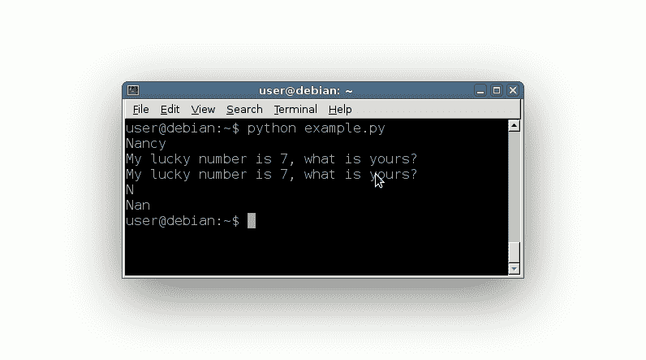

# 字符串

> 原文： [https://pythonbasics.org/strings/](https://pythonbasics.org/strings/)

每当您想在 Python 中使用 _ 文本 _ 时，都在使用 _ 字符串 _。 如果您使用双引号，Python 会理解您要使用字符串。

创建字符串后，您可以直接直接打印字符串变量。 您可以使用块引号访问字符。


## 字符串

### 定义字符串

变量可以是字符串数据类型。 它们可以容纳字符或文本。
如果创建字符串变量 x。 您可以使用 print（）函数在屏幕上显示它。

```py
x = "Hello"
print(x)

```

### 字符串索引

可以使用块引号访问各个字符，计数从零开始。

```py
print(x[0])
print(x[1])

```

第一个字符从零开始。 这可能有点反常，但有历史原因。

### 子字符串

通过使用冒号，您可以创建一个子字符串。 如果没有写开始或结束编号，Python 会假定您是第一个字符或最后一个字符。

请尝试以下示例：

```py
x = "hello world"
s = x[0:3]
print(s)
s = x[:3]
print(s)

```

### 完整的示例

这个例子做了很多字符串操作，例如打印文本，数字，组合字符串，切片和访问元素。

请尝试以下程序：

```py
x = "Nancy"
print(x)

# Combine numbers and text
s = "My lucky number is %d, what is yours?" % 7
print(s)

# alternative method of combining numbers and text
s = "My lucky number is " + str(7) + ", what is yours?"
print(s)

# print character by index
print(x[0])

# print piece of string
print(x[0:3])

```

您应该看到以下输出：



## 练习

试试下面的练习

1.  制作一个显示您喜欢的演员的程序。
2.  尝试在 s 中打印“ lucky”一词。
3.  尝试以“今天是 2/2/2016”的格式打印日，月，年。

[下载示例](https://gum.co/dcsp)