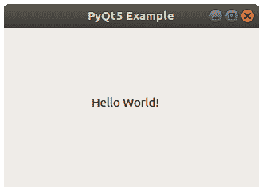

# PyQt Hello World

> 原文： [https://pythonbasics.org/PyQt-Hello-World/](https://pythonbasics.org/PyQt-Hello-World/)

带有 PyQT 的“ Hello World”程序是一个用于创建桌面应用程序的模块。 在本文中，您将学习如何在 PyQt 中创建“ hello world”应用。

如果您想制作桌面应用程序或图形用户界面，PyQT 就是一个很好的模块。
在开始本教程之前，请确保已安装 PyQt5。

**相关课程：**
[带有 Python 的 PyQt 桌面应用程序](https://gum.co/pysqtsamples)

## PyQt Hello World

### 范例

下面的程序创建“ hello world”窗口。

```
import sys
from PyQt5.QtWidgets import QApplication, QWidget, QLabel
from PyQt5.QtGui import QIcon
from PyQt5.QtCore import pyqtSlot

def window():
   app = QApplication(sys.argv)
   widget = QWidget()

   textLabel = QLabel(widget)
   textLabel.setText("Hello World!")
   textLabel.move(110,85)

   widget.setGeometry(50,50,320,200)
   widget.setWindowTitle("PyQt5 Example")
   widget.show()
   sys.exit(app.exec_())

if __name__ == '__main__':
   window()

```



### 工作原理

PyQT 使用以下代码初始化：

```
app = QApplication(sys.argv)
widget = QWidget()

```

文本不能立即添加到窗口中。 必须将其添加到标签。

标签是可以显示文本或图像的小部件。 这些行创建一个 QLabel，设置标签的文本和位置（水平，垂直）。

```
textLabel = QLabel(widget)
textLabel.setText("Hello World!")
textLabel.move(110,85)

```

现在您应该显示该窗口。

使用 setGeometry（）方法设置起始位置（50,50）和窗口大小（320,200）。

```
widget.setGeometry(50,50,320,200)

```

然后您要显示窗口！ 用 setWindowTitle（）给它一个标题，并用 show（）显示它。

```
widget.setWindowTitle("PyQt5 Example")
widget.show()

```

[下载示例](https://gum.co/pysqtsamples)