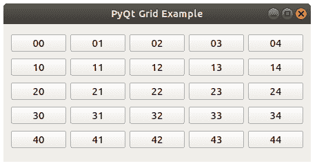

# PyQt 网格

> 原文： [https://pythonbasics.org/PyQt-grid/](https://pythonbasics.org/PyQt-grid/)

PyQt **QGridLayout** 是另一种布局。
通常，您可以使用 _.move（x，y）_ 来定位小部件（按钮，标签等）。 网格不是这样。

它以 AxB 形式放置小部件。 其中，A 是列数，B 是行数。 与您在 excel 中看到的类似。

QGridLayout 是 PyQt5.QtWidgets 的一部分。

**相关课程：**
[带有 Python 的 PyQt 桌面应用程序](https://gum.co/pysqtsamples)

## 范例

### QGridLayout

您可以使用单行代码创建 QGridLayout 或网格：

```
grid = QGridLayout()

```

告诉窗口使用网格：

```
win.setLayout(grid)

```

可以使用以下工具将小部件添加到网格：

```
grid.addWidget(widget,col,row)

```



### 网格示例

下面的代码创建一个包含一组按钮的布局。 它通过使用嵌套的 for 循环添加一组按钮。

创建网格的关键部分是：

```
grid = QGridLayout()

for i in range(0,5):
   for j in range(0,5):
       grid.addWidget(QPushButton(str(i)+str(j)),i,j)

win.setLayout(grid)

```

其余代码仅创建窗口。 但是复制和粘贴很容易。

```
import sys
from PyQt5.QtWidgets import QApplication, QWidget, QLabel, QGridLayout, QPushButton
from PyQt5.QtGui import QIcon
from PyQt5.QtCore import pyqtSlot

def window():
   app = QApplication(sys.argv)
   win = QWidget()
   grid = QGridLayout()

   for i in range(0,5):
      for j in range(0,5):
         grid.addWidget(QPushButton(str(i)+str(j)),i,j)

   win.setLayout(grid)
   win.setWindowTitle("PyQt Grid Example")
   win.setGeometry(50,50,200,200)
   win.show()
   sys.exit(app.exec_())

if __name__ == '__main__':
   window()

```

[下载示例](https://gum.co/pysqtsamples)