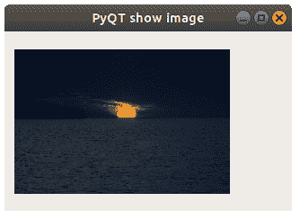

# PyQT QPixmap

> 原文： [https://pythonbasics.org/PyQT-QPixmap/](https://pythonbasics.org/PyQT-QPixmap/)

QPixmap 可用于在 PyQT 窗口中显示图像。 QPixmap（）可以加载图像，因为它具有文件名作为参数。 要显示图像，请将 QPixmap 添加到 QLabel。

QPixmap 支持所有主要的图像格式：BMP，GIF，JPG，JPEG，PNG，PBM，PGM，PPM，XBM 和 XPM。


[带有 Python 的 PyQt 桌面应用程序](https://gum.co/pysqtsamples)

## PyQT 图片

### QPixmap

首先创建一个 QPixmap 和一个 Q​​Label。 然后，您可以像这样组合它们：

```py
self.im = QPixmap("./image.jpg")
self.label = QLabel()
self.label.setPixmap(self.im)

```

然后将整个内容添加到布局中，例如 QGridLayout

```py
self.grid = QGridLayout()
self.grid.addWidget(self.label,1,1)
self.setLayout(self.grid)

```



### 示例

复制并粘贴下面的代码，以从本地计算机加载图像。 该图像将以网格布局显示。

```py
import sys
from PyQt5.QtWidgets import QApplication, QMainWindow, QLabel, QGridLayout, QWidget
from PyQt5.QtGui import QPixmap

class Example(QWidget):

    def __init__(self):
        super().__init__()

        self.im = QPixmap("./image.jpg")
        self.label = QLabel()
        self.label.setPixmap(self.im)

        self.grid = QGridLayout()
        self.grid.addWidget(self.label,1,1)
        self.setLayout(self.grid)

        self.setGeometry(50,50,320,200)
        self.setWindowTitle("PyQT show image")
        self.show()

if __name__ == '__main__':
    app = QApplication(sys.argv)
    ex = Example()
    sys.exit(app.exec_())

```

[下载示例](https://gum.co/pysqtsamples)